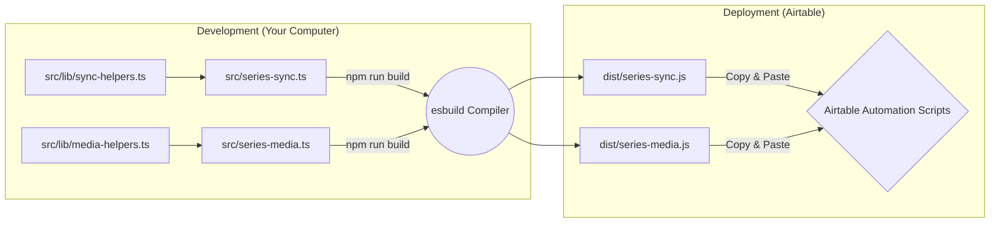

Of course. Here is a comprehensive and well-thought-out `README.md` for the `quick-sync-scripts` directory.

This document replaces the outdated instructions, accurately reflects the modern TypeScript architecture, and provides a clear, step-by-step guide for developers to maintain and extend the Airtable scripts.

---

# Airtable Quick Sync Scripts

This is a TypeScript project that contains all the "client-side" scripts for the Airtable-to-WordPress synchronization system. These scripts run inside Airtable Automations, gather record data, and send it to the `quick-sync-plugin` on the WordPress server.

## Core Architecture

This is not a collection of standalone scripts. It is a modern TypeScript project that must be **compiled** before use. This approach provides significant advantages:

*   **Type Safety:** TypeScript prevents common errors before the code ever runs in Airtable.
*   **Shared Logic:** Common functions for authentication, data handling, and media uploads are centralized in `src/lib/` for consistency and easy updates.
*   **Modularity:** Each CPT or Taxonomy has its own small, clean entry-point file, which is easy to read and manage.
*   **Build Process:** A standardized build process (`npm run build`) minifies the code, making it efficient to paste into Airtable.



---

## Developer Setup

**Prerequisites:** You must have [Node.js](https://nodejs.org/) and `npm` installed.

1.  **Install Dependencies:** From within this directory (`quick-sync-scripts/`), run:
    ```bash
    npm install
    ```

2.  **Build the Scripts:** To compile all TypeScript files from `src/` into JavaScript files in `dist/`, run:
    ```bash
    npm run build
    ```

3.  **Watch for Changes (Development):** To automatically re-compile whenever you save a file, run:
    ```bash
    npm run watch
    ```

---

## The Two-Step Sync Process

For each record, we use a two-step automation in Airtable to ensure media is handled correctly.

1.  **Media Sync Script:** Runs first. It uploads images/files to WordPress and saves the returned WordPress Media IDs back to the Airtable record.
2.  **Data Sync Script:** Runs second. It sends all the record's text data, taxonomy data, and the stable WordPress Media IDs from Step 1 to the custom endpoint in our plugin.

## How to Add a New Sync Workflow (e.g., for an "Events" CPT)

Follow this two-step process to create the necessary scripts for a new CPT.

### Step 1: Create the Media Script

This script handles the image attachments.

1.  Create a new file in the `src/` directory: `events-media.ts`.
2.  Add the following code, customizing the `eventsMediaConfig` object for your needs.

    ```typescript
    // src/events-media.ts

    import { mediaSync, MediaSyncConfig } from './lib/media-helpers';

    // The single, valid call to input.config() for the entire script run.
    const scriptInput = input.config();

    const eventsMediaConfig: MediaSyncConfig = {
      // 1. The name of your Airtable table
      airtableTable: 'Events',

      // 2. The standard WordPress media endpoints
      envMediaEndpoints: {
        prod:    'https://four12global.com/wp-json/wp/v2/media',
        staging: 'https://wordpress-1204105-5660147.cloudwaysapps.com/wp-json/wp/v2/media',
      },

      // 3. Airtable fields used to track when a sync is needed
      lastModifiedField:     'media_last_modified',     // A "Last Modified Time" field
      publishTimestampField: 'media_publish_timestamp', // A "Date" field (set to "Last Modified")

      // 4. A list of all image/attachment fields for this CPT
      imageFields: [
        {
          attachmentField:    'event_featured_image',    // The attachment field
          wpIdField:          'event_featured_image_wp_id', // A number field for the WP ID
          wpUrlField:         'event_featured_image_link',  // A URL field for the WP URL
          airtableCacheField: 'event_featured_image_ext',   // A text field for the Airtable cache
          isMultiple:         false,
        },
        // Add another object here for the "banner_image", etc.
      ],
    };

    // This one line runs the entire sync process
    mediaSync(eventsMediaConfig, scriptInput);
    ```

### Step 2: Create the Data Script

This script handles all other fields and relationships.

1.  Create a new file in the `src/` directory: `events-sync.ts`.
2.  Add the following code, customizing the `FIELD_MAP` and config object.

    ```typescript
    // src/events-sync.ts

    import { quickSync, QuickSyncConfig, FieldMap } from './lib/sync-helpers';

    // The single, valid call to input.config()
    const scriptInput = input.config();

    // The FIELD_MAP is the heart of the configuration.
    // It maps 'Airtable Field Name' to the 'WordPress Payload Key'.
    const FIELD_MAP: FieldMap = {
      /* --- Core WP Fields --- */
      'event_title':   'post_title',
      'event_slug':    'post_name',
      'event_date':    'post_date',
      'event_status':  'post_status',
      'event_sku':     'sku',

      /* --- Taxonomy Fields --- */
      'event_category': 'event-categories',

      /* --- Media Fields (using the IDs from the media script!) --- */
      'event_featured_image_wp_id': {
        airtableIdField: 'event_featured_image_wp_id', // The field populated by events-media.js
        wpKey: '_thumbnail_id', // The special WordPress key for featured image
      },
    };

    const eventsSyncConfig: QuickSyncConfig = {
      airtableTable: 'Events',
      skuField:      'event_sku',   // The Airtable field holding the unique ID
      titleField:    'event_title', // The Airtable field for the post's title
      fieldMap:      FIELD_MAP,
      envEndpoints: {
        prod:    'https://four12global.com/wp-json/four12/v1/event-sync',
        staging: 'https://wordpress-1204105-5660147.cloudwaysapps.com/wp-json/four12/v1/event-sync',
      },
    };

    // Run the sync process
    quickSync(eventsSyncConfig, scriptInput);
    ```

---

## Deployment to Airtable

The code you write in `src/` is **not** what you paste into Airtable. You must use the compiled output.

1.  **Build the Code:** Run `npm run build` in your terminal. This will create/update the JavaScript files in the `dist/` directory.

2.  **Copy the Script:**
    *   Open the compiled file (e.g., `dist/events-media.js`).
    *   Select all (`Cmd+A` or `Ctrl+A`) and copy the entire contents.

3.  **Paste into Airtable:**
    *   In your Airtable Automation, add a "Run a script" action.
    *   Delete any placeholder code and paste your copied script.

4.  **Configure Inputs:** The scripts require two input variables to be configured in the Airtable UI:
    *   `recordId`: Set its value to the `Airtable record ID` from the automation's trigger step.
    *   `env`: A text string. Type `prod` for your production base or `staging` for your staging base. This allows the script to target the correct WordPress environment.

Repeat this process for the data sync script (`dist/events-sync.js`), ensuring it runs as the next step in the same automation.